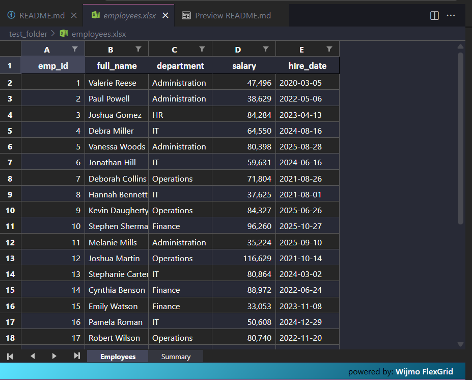

# 🏢 Employee Data Generator

A GUI application that generates realistic employee data and exports it to Excel files.



**Sample Output:** [employees.xlsx](samples/employees.xlsx)


## ✨ Features

- **Step-by-step workflow** with clear guidance
- **Real-time input validation** and progress tracking
- **Customizable employee count** (up to 10,000 records)
- **Realistic data generation** using Faker library
- **Excel export** with automatic file naming
- **Cross-platform support** (Windows, WSL, Linux)

## 🚀 Quick Start

### 1. Clone the Repository
```bash
git clone https://github.com/greatdecipher/employee-data.git
cd employee-data
```

### 2. Create Virtual Environment

**Windows:**
```cmd
python -m venv .venv
.venv\Scripts\activate
```

**WSL/Linux:**
```bash
python3 -m venv .venv
source .venv/bin/activate
```

### 3. Install Dependencies
```bash
pip install -r requirements.txt
```

### 4. Run the Application
```bash
python -m main
```

## 🧪 Testing

Run the test suite to ensure everything works:
```bash
pytest
```

## 🔧 WSL Users - Fix Qt Display Issues

If you see Wayland errors in WSL, set this environment variable:
```bash
export QT_QPA_PLATFORM=xcb
```

Or add it to your `~/.bashrc` for permanent fix:
```bash
echo "export QT_QPA_PLATFORM=xcb" >> ~/.bashrc
source ~/.bashrc
```

## 📁 Project Structure

```
employee-data/
├── employee_app/          # Main application package
│   ├── app.py            # GUI application
│   ├── generator.py      # Data generation logic
│   └── exporter.py       # Excel export functionality
├── tests/                # Unit tests
├── main.py              # Application entry point
├── requirements.txt     # Python dependencies
└── README.md           # This file
```

## 🎯 How to Use

1. **Enter Number of Employees**: Type how many records you want (1-10,000)
2. **Select Output Folder**: Choose where to save the Excel file
3. **Generate Data**: Click to create realistic employee data
4. **Export to Excel**: Save your data to an Excel file

## 📊 Generated Data Fields

- **Employee ID**: Unique identifier
- **Full Name**: Realistic names using Filipino locale
- **Department**: IT, HR, Operations, Administration, Finance
- **Salary**: Random amounts between $25,000 - $120,000
- **Hire Date**: Random dates from 2020 to present

## 🛠️ Dependencies

- **PySide6**: Modern Qt GUI framework
- **pandas**: Data manipulation and analysis
- **Faker**: Realistic fake data generation
- **xlsxwriter**: Excel file creation

## 📝 Requirements

- Python 3.8 or higher
- Virtual environment (recommended)
- 50MB free disk space

## 🐛 Troubleshooting

**Import Errors:**
- Make sure virtual environment is activated
- Verify all dependencies are installed: `pip list`

**Qt Display Issues (WSL):**
- Set `QT_QPA_PLATFORM=xcb` environment variable
- Ensure X11 forwarding is enabled

**Test Failures:**
- Run `pytest -v` for detailed output
- Check that all dependencies are correctly installed

---

🎉 **Happy Data Generating!** 

For issues or contributions, please visit the [GitHub repository](https://github.com/greatdecipher/employee-data).